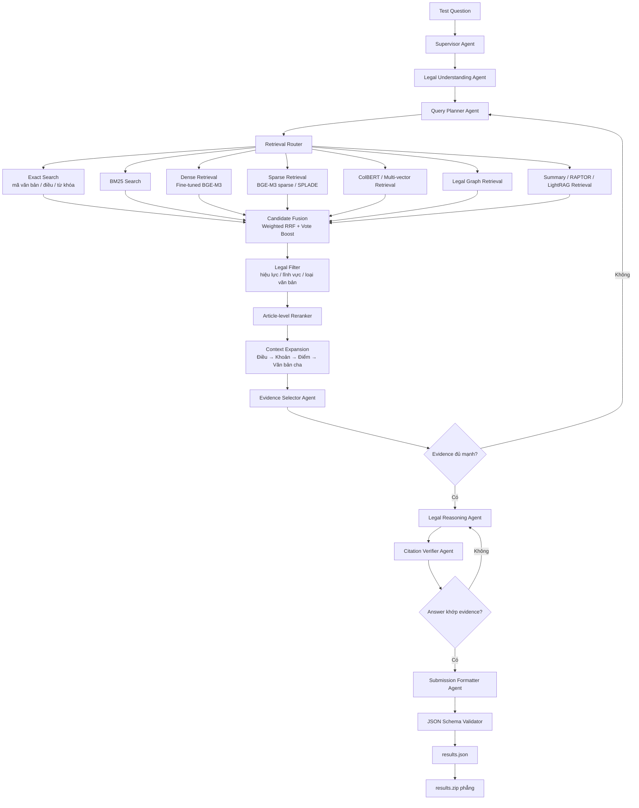

# Legal Agent RAG

Hệ thống hỏi đáp pháp luật tiếng Việt theo hướng multi-agent RAG. Mục tiêu là truy hồi đúng điều luật/văn bản liên quan, chọn evidence, kiểm chứng citation và xuất kết quả cuối theo định dạng submission.

## Pipeline



Luồng chính:

```text
Question
-> Legal Understanding
-> Query Planning
-> Multi-retrieval
-> Fusion + Filter + Rerank
-> Evidence Selection
-> Legal Reasoning
-> Citation Verification
-> results.json
-> results.zip
```

## Trạng thái hiện tại

Đã có:

- Download dữ liệu từ Hugging Face.
- Process dữ liệu Pháp điển.
- Process metadata và quan hệ văn bản VBPL.
- Schema cho `LegalDocument`, `LegalArticle`, `LegalEdge`.
- Tạo `legal_units.parquet`.
- Dense indexing lên Qdrant.

Đang cần triển khai tiếp:

- Các retriever: exact, BM25, sparse, ColBERT, graph.
- Fusion, reranker, context expansion.
- Các agent: supervisor, planner, evidence selector, reasoner, verifier, formatter.
- Validator và đóng gói submission.

## Cấu trúc repo

```text
configs/       Cấu hình data/model/retrieval/eval
scripts/       Script chạy pipeline
src/data/      Download, process, chuẩn hóa dữ liệu
src/schema/    Pydantic schema
src/indexing/  Build index
src/retrieval/ Retriever
src/agents/    Multi-agent workflow
src/eval/      Evaluation
src/submission Build, validate, zip kết quả
tests/         Unit tests
```

## Cài đặt

```bash
conda create -n legal_rag_agent python=3.11
conda activate legal_rag_agent
pip install -r requirements.txt
```

Nếu dùng Qdrant:

```bash
docker run -p 6333:6333 qdrant/qdrant
```

## Tải và xử lý dữ liệu

Chạy các lệnh từ thư mục gốc của repository.

### 1. Tải dữ liệu

```bash
python scripts/01_download_data.py
```

Script tải các nguồn Hugging Face vào `data/raw/`:

- Pháp điển: `tmquan/phapdien-moj-gov-vn`.
- Văn bản pháp luật: `th1nhng0/vietnamese-legal-documents`.
- VBPL Markdown: `tmquan/vbpl-vn`.
- Legal instruction: `duyet/vietnamese-legal-instruct`.

Dữ liệu có dung lượng lớn, cần bảo đảm đủ dung lượng ổ đĩa và kết nối
mạng ổn định.

### 2. Build dataset retrieval

```bash
python scripts/02_process_data.py
```

Script lần lượt:

1. Chuẩn hóa metadata văn bản VBPL.
2. Tách nội dung VBPL thành từng Điều.
3. Tạo quan hệ giữa các văn bản.
4. Chuẩn hóa dữ liệu Pháp điển.
5. Hợp nhất VBPL và Pháp điển thành `legal_units`.
6. Chia Điều dài thành retrieval chunks.
7. Tạo mapping dùng cho submission.

Các file đầu ra nằm trong `data/processed/`:

```text
documents.parquet
vbpl_articles.parquet
legal_edges.parquet
phapdien-moj-gov-vn.parquet
legal_units.parquet
retrieval_corpus.parquet
submission_mapping.parquet
```

Để chạy riêng từng bước:

```bash
python -m src.data.process_vbpl
python -m src.data.process_phapdien
python -m src.data.build_legal_units
python -m src.chunking.build_retrieval_corpus
python -m src.data.build_submission_mapping
```

## Tạo embedding trên Modal và ingest Qdrant Docker

Pipeline:

```text
retrieval_corpus.parquet
        |
        v
Modal A100 80GB tạo dense embedding float16
        |
        v
Modal Volume: embedding_shards/part-*.parquet
        |
        v
data/embedding_shards trên ổ D
        |
        v
Qdrant Docker: data/qdrant_storage trên ổ D
```

`data/embedding_shards` là Parquet trung gian. `data/qdrant_storage` là
database nội bộ của Qdrant gồm vector segments, BM25, WAL và HNSW. Không mount
thư mục shard trực tiếp vào `/qdrant/storage`.

### 1. Chuẩn bị Modal trong WSL

```bash
cd /mnt/d/legal-agent-rag
conda activate legal_rag_agent
pip install -r requirements.txt
modal token new
```

Tạo secret chứa Hugging Face token quyền `Read`:

```bash
modal secret create legal-rag-secrets \
  HF_TOKEN="YOUR-HF-TOKEN"
```

Không ghi token thật vào README, source code, log hoặc Git. Nếu token đã từng
bị công khai, phải thu hồi và tạo token mới.

### 2. Upload corpus lên Modal Volume

```bash
modal run scripts/modal_ingest.py --action upload
```

Corpus được lưu trong Modal Volume `legal-rag-ingest-data`.

### 3. Tạo embedding bằng A100 80GB

Chạy mới và xóa checkpoint/shard cũ:

```bash
modal run --detach scripts/modal_ingest.py --action start --recreate
```

Job thử batch từ `8192` và tự giảm đến `128` khi thiếu VRAM. Batch ổn định
thực tế trên A100 80GB là `2048`.

Nếu job bị preempt, hết spending limit hoặc dừng giữa chừng, resume bằng:

```bash
modal run --detach scripts/modal_ingest.py --action start
```

Không dùng `--recreate` khi resume. Checkpoint được lưu theo Parquet row group.

Theo dõi:

```bash
modal app list
modal app logs legal-rag-embedding -f
modal volume ls legal-rag-ingest-data /embedding_shards
```

Khi hoàn thành phải có `101` file từ `part-0000.parquet` đến
`part-0100.parquet`.

### 4. Tải embedding shards về ổ D

```bash
cd /mnt/d/legal-agent-rag
modal volume get \
  legal-rag-ingest-data \
  /embedding_shards \
  data/embedding_shards
```

Không tải vào `/home/...` vì WSL virtual disk thường nằm trên ổ C.

Kiểm tra:

```bash
find data/embedding_shards -name "part-*.parquet" | wc -l
du -sh data/embedding_shards
```

Số file phải là `101`.

### 5. Chạy Qdrant Docker local

`docker-compose.yml` bind mount Qdrant storage vào:

```text
D:\legal-agent-rag\data\qdrant_storage
```

Khởi động:

```bash
docker compose down
docker compose up -d
```

Kiểm tra:

```bash
curl http://localhost:6333/healthz
docker inspect legal-agent-qdrant \
  --format '{{range .Mounts}}{{.Source}} -> {{.Destination}}{{end}}'
```

Mount phải trỏ từ `D:\legal-agent-rag\data\qdrant_storage` tới
`/qdrant/storage`.

### 6. Ingest shards vào Qdrant

```bash
cd /mnt/d/legal-agent-rag
conda activate legal_rag_agent
python scripts/modal_shards_to_qdrant.py
```

Script sẽ:

1. Đọc dense embedding float16 từ từng shard.
2. Tạo BM25 sparse vector trên CPU.
3. Upload dense + sparse + payload vào Qdrant.
4. Lưu checkpoint tại
   `data/embedding_shards/qdrant_checkpoint.json`.
5. Bật HNSW `m=16`, `on_disk=True` sau khi hoàn tất.

Nếu ingest local bị dừng, chạy lại cùng lệnh để resume.

### 7. Kiểm tra collection

```bash
curl http://localhost:6333/collections/legal_agent_rag_harrier_idf
```

Kiểm tra `points_count` đạt khoảng `1.008.658`, collection có named vector
`dense`, sparse vector `sparse`, và optimizer không báo lỗi.

Sau khi xác nhận search hoạt động, có thể xóa `data/embedding_shards` để giải
phóng dung lượng. Nên giữ shards nếu muốn rebuild Qdrant mà không chạy Modal
lần nữa.

### Qdrant báo mất collection sau khi WSL restart

Khi Qdrant dùng bind mount từ `/mnt/d`, Docker đôi lúc vẫn báo mount đúng nhưng
`/qdrant/storage` bên trong container lại trở thành `tmpfs` rỗng. Collection lúc
đó không xuất hiện, dù dữ liệu cũ vẫn còn trong:

```text
D:\legal-agent-rag\data\qdrant_storage
```

Kiểm tra:

```bash
docker exec legal-agent-qdrant df -T /qdrant/storage
docker exec legal-agent-qdrant du -sh /qdrant/storage
du -sh data/qdrant_storage
curl http://localhost:6333/collections
```

Nếu container hiển thị `tmpfs` và chỉ có vài KB, trong khi thư mục host vẫn
khoảng `7.9G`, hãy tạo lại container:

```bash
docker compose down
docker compose up -d --force-recreate
```

Sau đó kiểm tra lại:

```bash
docker exec legal-agent-qdrant du -sh /qdrant/storage
curl http://localhost:6333/collections
```

Không chạy `docker compose down -v`, vì tùy cấu hình lệnh này có thể xóa volume.
Nếu lỗi lặp lại, nên chuyển Qdrant storage sang Docker named volume hoặc
filesystem ext4 của WSL. Bind mount từ ổ Windows qua `/mnt/d` không ổn định cho
database sử dụng mmap như Qdrant.

## Test

```bash
pytest
```

Một số test yêu cầu đã có dữ liệu trong `data/processed/`.
