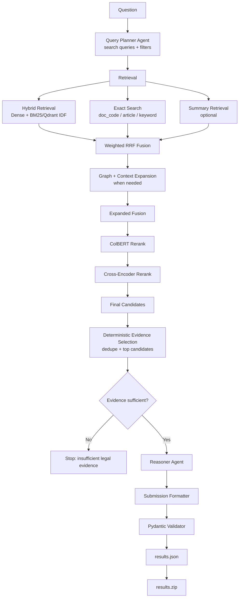

# Legal Agent RAG

Hệ thống hỏi đáp pháp luật Việt Nam theo hướng Agentic RAG. Repo tập trung vào
việc chuẩn hóa dữ liệu văn bản pháp luật, xây dựng corpus retrieval, ingest vào
Qdrant và chạy pipeline sinh câu trả lời có căn cứ.

## Tổng Quan

Pipeline hiện tại kết hợp:

- Legal query planning bằng LLM.
- Hybrid retrieval trên Qdrant: dense vector + BM25 sparse vector.
- Exact search theo mã văn bản/điều nếu câu hỏi có định danh rõ.
- Graph/context expansion để bổ sung văn bản hoặc đơn vị pháp lý liên quan.
- ColBERT và cross-encoder rerank.
- Chọn evidence deterministic từ candidates đã rerank.
- Reasoning, formatter và validate schema submission.

## Pipeline



## Cấu Trúc

```text
scripts/        Entrypoint download, process, ingest, inference, submission
src/agents/     Agent và prompt nghiệp vụ
src/chunking/   Tạo retrieval corpus
src/common/     Config, embedding, BM25
src/data/       Download và chuẩn hóa dữ liệu
src/generation/ Groq/endpoint/local LLM client
src/indexing/   Graph index và Qdrant collection
src/pipeline/   Orchestration inference
src/retrieval/  Retrieval, fusion, expansion, rerank
src/schema/     Pydantic schema
src/submission/ Validate và đóng gói kết quả
tests/          Unit tests
```

## Yêu Cầu

- Python 3.11
- Docker hoặc Docker Desktop để chạy Qdrant local
- NVIDIA GPU nếu chạy local LLM/reranker
- HuggingFace token nếu cần tải model private/gated

## Cài Đặt

```bash
conda create -n legal_rag_agent python=3.11
conda activate legal_rag_agent
pip install -r requirements.txt
```

Khởi động Qdrant:

```bash
docker compose up -d
curl http://localhost:6333/healthz
```

## Cấu Hình

Tạo file `.env` ở root repo:

```env
HF_TOKEN=your-huggingface-token

QDRANT_URL=http://localhost:6333
QDRANT_API_KEY=
QDRANT_COLLECTION=legal_agent_rag_harrier_idf

# LLM: groq, endpoint hoặc local
LLM_BACKEND=groq
GROQ_API_KEY=your-groq-api-key
GROQ_MODEL=llama-3.3-70b-versatile
GROQ_TIMEOUT=120
LLM_ENDPOINT_URL=https://your-endpoint.example
LLM_ENDPOINT_TIMEOUT=600
LOCAL_LLM_MODEL=Qwen/Qwen3-4B-Instruct-2507
LOCAL_LLM_MAX_MODEL_LEN=4096
LOCAL_LLM_LOAD_IN_4BIT=true

# Retrieval/rerank
DENSE_MODEL=mainguyen9/vietlegal-harrier-0.6b
COLBERT_MODEL=BAAI/bge-m3
RETRIEVAL_TOP_K=40
INITIAL_FUSION_TOP_K=40
COLBERT_TOP_K=20
CROSS_ENCODER_TOP_K=10
FINAL_TOP_K=8
RERANK_MAX_CHARS=600
COLBERT_BATCH_SIZE=4
CROSS_ENCODER_BATCH_SIZE=4

# Graph/context
GRAPH_SEED_TOP_K=5
GRAPH_TOP_K=10
CONTEXT_TOP_K=10
PRELOAD_GRAPH=true
```

Gợi ý cho GPU 12 GB: giữ `COLBERT_BATCH_SIZE=2..4`,
`CROSS_ENCODER_BATCH_SIZE=2..4`, `LOCAL_LLM_MAX_MODEL_LEN=4096`. Int4 chỉ giảm
VRAM của LLM, không giảm bộ nhớ cho dense model, ColBERT, cross-encoder và KV
cache.

## Chuẩn Bị Dữ Liệu

Chạy theo thứ tự:

```bash
python scripts/01_download_data.py
python scripts/02_process_data.py
python -m src.indexing.build_graph
```

Sau xử lý, các file chính nằm trong `data/processed/`:

```text
documents.parquet
vbpl_articles.parquet
legal_edges.parquet
legal_units.parquet
retrieval_corpus.parquet
submission_mapping.parquet
```

## Tạo Embedding Và Ingest Qdrant

Nếu đã có embedding shards:

```bash
python -m scripts.modal_shards_to_qdrant --recreate --build-hnsw
python scripts/05_create_payload_indexes.py
```

Nếu cần chạy embedding trên Modal:

```bash
modal token new
modal secret create legal-rag-secrets HF_TOKEN="YOUR-HF-TOKEN"
modal run scripts/modal_ingest.py --action upload
modal run --detach scripts/modal_ingest.py --action start --recreate
```

Tải shards về local:

```bash
modal volume get legal-rag-ingest-data /embedding_shards data/embedding_shards
```

Ingest vào Qdrant:

```bash
python -m scripts.modal_shards_to_qdrant \
  --shards-dir data/embedding_shards \
  --recreate \
  --build-hnsw
python scripts/05_create_payload_indexes.py
```

## Chạy Inference

Một câu hỏi:

```bash
python -m scripts.03_run_inference \
  --query "Điều kiện hỗ trợ doanh nghiệp nhỏ và vừa là gì?" \
  --question-id 1 \
  --output results.json
```

Chạy từ file câu hỏi:

```bash
python -m scripts.03_run_inference \
  --input R2AIStage1DATA.json \
  --output results.json \
  --batch-size 1
```

Chạy batch lớn 2000 câu, giữ model sống trong một process và ghi kết quả sau
từng query:

```bash
python scripts/06_run_2000_queries.py \
  --input R2AIStage1DATA.json \
  --output results.json \
  --errors inference_errors.json \
  --limit 2000 \
  --resume
```

Chọn backend LLM ở CLI:

```bash
python -m scripts.03_run_inference --llm groq
python -m scripts.03_run_inference --llm endpoint
python -m scripts.03_run_inference --llm local --local-model Qwen/Qwen3-4B-Instruct-2507
```

## Đóng Gói Submission

```bash
python scripts/04_build_submission.py \
  --input results.json \
  --output results.zip
```

`results.zip` là ZIP phẳng chỉ chứa `results.json`.

## Kiểm Thử

```bash
pytest -q
```

Một số nhóm test hữu ích:

```bash
pytest tests/test_query_planner.py tests/test_formatter.py -q
pytest tests/test_reasoner.py tests/test_formatter.py -q
pytest tests/test_retrieval.py tests/test_inference_pipeline.py -q
```

## File Không Commit

Không commit các artifact runtime:

```text
.env
data/raw/
data/processed/
data/embedding_shards*/
data/qdrant_storage/
data/qdrant_snapshots/
results.json
results.zip
inference_errors.json
*.parquet
*.pt
*.bin
*.safetensors
*.log
```

## Lệnh Nhanh

```bash
conda activate legal_rag_agent
docker compose up -d
python scripts/01_download_data.py
python scripts/02_process_data.py
python -m scripts.modal_shards_to_qdrant --recreate --build-hnsw
python scripts/05_create_payload_indexes.py
python -m scripts.03_run_inference --query "Câu hỏi pháp luật"
python scripts/04_build_submission.py
```
