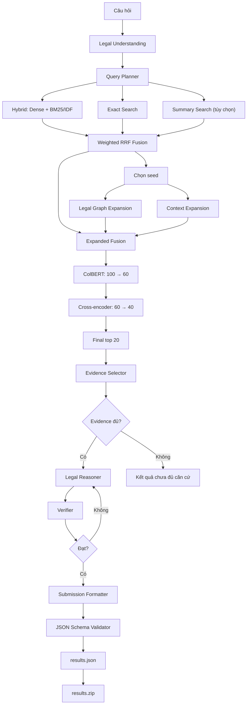

# Legal Agent RAG

> Hệ thống hỏi đáp pháp luật Việt Nam sử dụng hybrid retrieval, reranking và
> multi-agent reasoning để tạo câu trả lời có căn cứ từ văn bản pháp luật.

## ✨ Tổng quan

Legal Agent RAG xử lý câu hỏi theo ba lớp:

1. **Hiểu và lập kế hoạch**: phân tích ý định, thực thể pháp lý, filter và sinh
   nhiều truy vấn tìm kiếm.
2. **Truy hồi và chọn evidence**: kết hợp dense, BM25/IDF, exact search, graph,
   context expansion, ColBERT và cross-encoder.
3. **Sinh và kiểm chứng câu trả lời**: chọn evidence, kiểm tra độ đầy đủ, reasoning,
   verification, format và validate kết quả.

### Công nghệ chính

| Thành phần | Công nghệ |
|---|---|
| Vector database | Qdrant |
| Dense embedding | `mainguyen9/vietlegal-harrier-0.6b` |
| Sparse retrieval | BM25 + Qdrant IDF |
| Token-level rerank | BGE-M3 ColBERT |
| Cross-encoder | `Qwen/Qwen3-Reranker-0.6B` |
| LLM agents | Groq, mặc định `llama-3.1-8b-instant` |
| Cloud embedding | Modal A100 80 GB |
| Data format | Parquet, Pydantic, JSON |

## 🧭 Pipeline



## ✅ Trạng thái triển khai

Đã có:

- Xử lý dữ liệu VBPL và Pháp điển.
- Article-aware chunking và submission mapping.
- Dense + BM25 sparse index trong Qdrant.
- Exact, hybrid, graph, summary retrieval và context expansion.
- Weighted RRF fusion, ColBERT và cross-encoder rerank.
- Legal Understanding, Query Planner, Evidence Selector, Sufficiency Checker,
  Reasoner, Verifier và Formatter.
- Validation `results.json` và tạo ZIP phẳng.
- Checkpoint cho Modal embedding và local Qdrant ingest.

Giới hạn hiện tại:

- `scripts/03_run_inference.py` đang dùng câu hỏi hard-code, chưa nhận `--query`.
- Sufficiency chưa tự chạy lại toàn bộ retrieval với query mới.
- Summary retrieval có implementation nhưng mặc định tắt.
- Chưa có supervisor orchestration riêng và benchmark chính thức.

## 📁 Cấu trúc repository

```text
scripts/
├── 01_download_data.py
├── 02_process_data.py
├── 03_run_inference.py
├── 04_build_submission.py
├── 05_create_payload_indexes.py
├── modal_ingest.py
├── modal_shards_to_qdrant.py
└── monitor_ingest_and_shutdown.ps1

src/
├── agents/       Agent và prompt nghiệp vụ
├── chunking/     Tạo retrieval corpus
├── common/       Config, embedding và BM25
├── data/         Download và chuẩn hóa dữ liệu
├── generation/   Groq LLM client
├── indexing/     Graph index và Qdrant collection
├── retrieval/    Retrieval, fusion, expansion và rerank
├── schema/       Pydantic schema
└── submission/   Validate, ghi và nén kết quả

tests/            Unit test
```

## ⚙️ Cài đặt

Yêu cầu:

- Python 3.11
- Docker Desktop
- WSL2 được khuyến nghị khi chạy pipeline và GPU local
- NVIDIA GPU nếu chạy reranker local

```bash
conda create -n legal_rag_agent python=3.11
conda activate legal_rag_agent
pip install -r requirements.txt
```

Tạo `.env`:

```env
GROQ_API_KEY=your-groq-api-key
HF_TOKEN=your-huggingface-read-token

QDRANT_URL=http://localhost:6333
QDRANT_COLLECTION=legal_agent_rag_harrier_idf

# Tùy chọn
DENSE_MODEL=mainguyen9/vietlegal-harrier-0.6b
COLBERT_MODEL=BAAI/bge-m3
QDRANT_TIMEOUT=120
```

Không commit `.env`, token, embedding shards hoặc Qdrant storage.

## 📥 Chuẩn bị dữ liệu

Chạy các lệnh từ thư mục gốc repository.

### 1. Download

```bash
python scripts/01_download_data.py
```

Dữ liệu được tải vào `data/raw/` từ:

- `tmquan/phapdien-moj-gov-vn`
- `th1nhng0/vietnamese-legal-documents`
- `tmquan/vbpl-vn`
- `duyet/vietnamese-legal-instruct`

### 2. Process

```bash
python scripts/02_process_data.py
```

Pipeline tạo:

```text
data/processed/
├── documents.parquet
├── vbpl_articles.parquet
├── legal_edges.parquet
├── phapdien-moj-gov-vn.parquet
├── legal_units.parquet
├── retrieval_corpus.parquet
└── submission_mapping.parquet
```

Các bước có thể chạy riêng:

```bash
python -m src.data.process_vbpl
python -m src.data.process_phapdien
python -m src.data.build_legal_units
python -m src.chunking.build_retrieval_corpus
python -m src.data.build_submission_mapping
python -m src.indexing.build_graph
```

## ☁️ Tạo embedding trên Modal

Modal sử dụng A100 80 GB, 16 CPU, 64 GB RAM và timeout 24 giờ. Batch bắt đầu từ
`8192`, tự giảm dần đến `128` nếu thiếu VRAM.

### 1. Đăng nhập và tạo secret

```bash
modal token new

modal secret create legal-rag-secrets \
  HF_TOKEN="YOUR-HF-TOKEN"
```

### 2. Upload corpus

```bash
modal run scripts/modal_ingest.py --action upload
```

Đổi đường dẫn corpus khi cần:

```bash
modal run scripts/modal_ingest.py \
  --action upload \
  --corpus data/processed/retrieval_corpus.parquet
```

### 3. Chạy embedding

Chạy mới và xóa checkpoint cũ:

```bash
modal run --detach scripts/modal_ingest.py \
  --action start \
  --recreate
```

Resume:

```bash
modal run --detach scripts/modal_ingest.py --action start
```

Theo dõi:

```bash
modal app logs legal-rag-embedding -f
modal volume ls legal-rag-ingest-data /embedding_shards
```

### 4. Tải shards

```bash
modal volume get \
  legal-rag-ingest-data \
  /embedding_shards \
  data/embedding_shards
```

Kiểm tra:

```bash
find data/embedding_shards -name "part-*.parquet" | wc -l
du -sh data/embedding_shards
```

## 🗄️ Qdrant local

### 1. Khởi động

```bash
docker compose up -d
curl http://localhost:6333/healthz
```

`docker-compose.yml` hiện bind mount:

```text
D:/legal-agent-rag/data/qdrant_storage → /qdrant/storage
```

Nếu clone repository sang vị trí khác, cần sửa `source` trong
`docker-compose.yml`.

### 2. Ingest shards

Tạo lại collection từ đầu:

```bash
python -m scripts.modal_shards_to_qdrant --recreate
```

Resume sau khi dừng:

```bash
python -m scripts.modal_shards_to_qdrant
```

Chỉ định thư mục khác:

```bash
python -m scripts.modal_shards_to_qdrant \
  --shards-dir data/embedding_shards_harrier
```

Ingest và bật HNSW sau khi hoàn thành:

```bash
python -m scripts.modal_shards_to_qdrant \
  --recreate \
  --build-hnsw
```

Lưu ý:

- Trong lúc ingest, collection dùng `HNSW m=0` và `indexing_threshold=0`.
- HNSW chỉ được bật thành `m=16` khi có flag `--build-hnsw`.
- Checkpoint nằm trong `<shards-dir>/qdrant_checkpoint.json`.
- Sparse vector được tạo bằng BM25; Qdrant áp dụng IDF ở collection.

### 3. Tạo payload indexes

Chạy sau khi collection đã tồn tại:

```bash
python scripts/05_create_payload_indexes.py
```

Các index:

| Field | Type |
|---|---|
| `is_current` | bool |
| `doc_code` | keyword |
| `doc_type` | keyword |
| `domain` | keyword |
| `sector` | keyword |

### 4. Kiểm tra collection

```bash
curl http://localhost:6333/collections
curl http://localhost:6333/collections/legal_agent_rag_harrier_idf
```

Collection hiện tại dự kiến có khoảng `1.008.658` points.

### Khắc phục Qdrant mount nhầm `tmpfs`

```bash
docker exec legal-agent-qdrant df -T /qdrant/storage
docker exec legal-agent-qdrant du -sh /qdrant/storage
```

Nếu `/qdrant/storage` là `tmpfs` rỗng nhưng dữ liệu trên ổ D vẫn còn:

```bash
docker compose down
docker compose up -d --force-recreate
```

Không chạy `docker compose down -v` nếu chưa chắc chắn về dữ liệu cần giữ.

## 🔎 Chạy inference

```bash
python scripts/03_run_inference.py
```

Script sẽ:

1. Load dense model, ColBERT và cross-encoder.
2. Chạy understanding và query planning.
3. Hybrid retrieval cho ba query.
4. Fusion, graph và context expansion.
5. ColBERT `100 → 60`, cross-encoder `60 → 40`, lấy top `20`.
6. Chọn tối đa `5` evidence.
7. Sufficiency check, reasoning và verification.
8. Validate citation và ghi `results.json`.
9. In latency của từng bước.

Để thay câu hỏi, hiện cần sửa biến `query` trong `main()` của
`scripts/03_run_inference.py`.

## 📦 Validate và đóng gói

```bash
python scripts/04_build_submission.py
```

Hoặc chỉ định đường dẫn:

```bash
python scripts/04_build_submission.py \
  --input results.json \
  --output results.zip
```

Script kiểm tra Pydantic schema rồi tạo ZIP phẳng:

```text
results.zip
└── results.json
```

## 🧪 Kiểm thử

```bash
pytest -q
```

Chạy nhóm test cụ thể:

```bash
pytest tests/test_retrieval.py -q
pytest tests/test_reasoner.py tests/test_verifier.py -q
pytest tests/test_validate_results.py tests/test_zip_results.py -q
```

Một số test xử lý dữ liệu cần các file trong `data/processed/`.

## 🔐 Dữ liệu không được commit

```text
.env
data/raw/
data/processed/
data/embedding_shards*/
data/qdrant_storage/
results.json
results.zip
*.parquet
*.pt
*.bin
*.safetensors
*.log
```

## 🛣️ Hướng phát triển

- Nhận câu hỏi từ CLI/API thay vì hard-code.
- Supervisor điều phối retry retrieval có giới hạn.
- Benchmark retrieval, article recall và answer quality.
- Claim-level citation verification.
- Batch inference cho tập câu hỏi và submission mapping đầy đủ.
- Cấu hình Docker storage không phụ thuộc đường dẫn ổ D.
