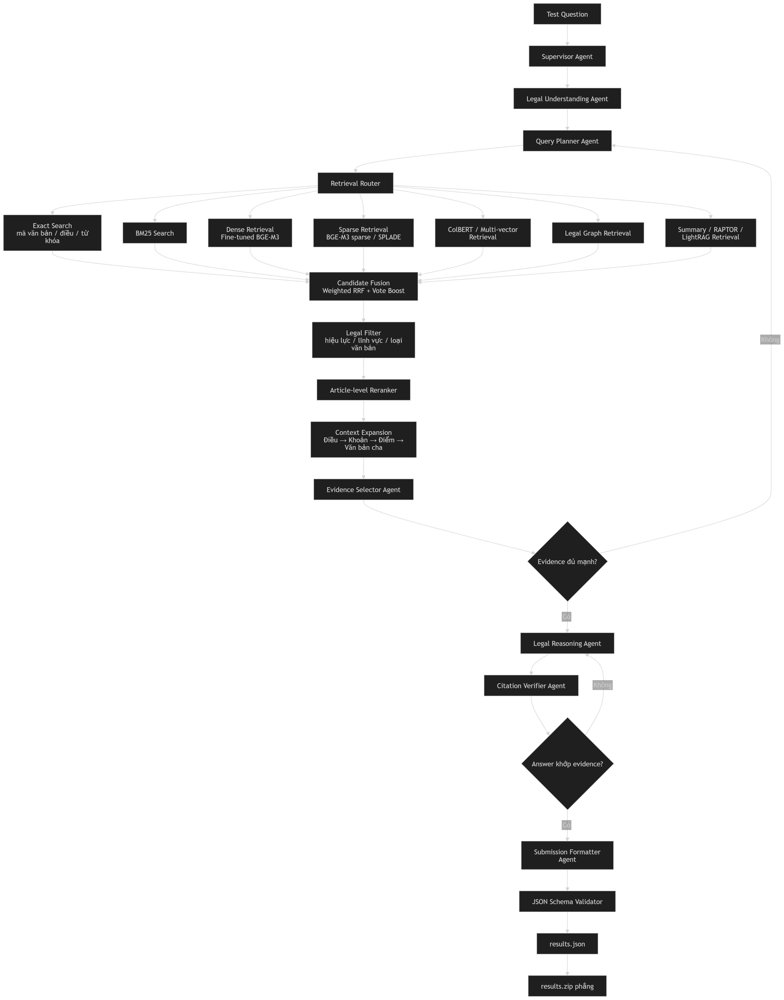

# Legal Agent RAG

Hệ thống hỏi đáp pháp luật tiếng Việt theo hướng multi-agent RAG. Mục tiêu là truy hồi đúng điều luật/văn bản liên quan, chọn evidence, kiểm chứng citation và xuất kết quả cuối theo định dạng submission.

## Pipeline

[](image/pipeline.png)

Luồng chính:

```text
Question
-> Legal Understanding
-> Query Planning
-> Multi-retrieval
-> Fusion + Filter + Rerank
-> Evidence Selection
-> Legal Reasoning
-> Citation Verification
-> results.json
-> results.zip
```

## Trạng thái hiện tại

Đã có:

- Download dữ liệu từ Hugging Face.
- Process dữ liệu Pháp điển.
- Process metadata và quan hệ văn bản VBPL.
- Schema cho `LegalDocument`, `LegalArticle`, `LegalEdge`.
- Tạo `legal_units.parquet`.
- Dense indexing lên Qdrant.

Đang cần triển khai tiếp:

- Các retriever: exact, BM25, sparse, ColBERT, graph.
- Fusion, reranker, context expansion.
- Các agent: supervisor, planner, evidence selector, reasoner, verifier, formatter.
- Validator và đóng gói submission.

## Cấu trúc repo

```text
configs/       Cấu hình data/model/retrieval/eval
scripts/       Script chạy pipeline
src/data/      Download, process, chuẩn hóa dữ liệu
src/schema/    Pydantic schema
src/indexing/  Build index
src/retrieval/ Retriever
src/agents/    Multi-agent workflow
src/eval/      Evaluation
src/submission Build, validate, zip kết quả
tests/         Unit tests
```

## Cài đặt

```bash
conda create -n legal_rag_agent python=3.11
conda activate legal_rag_agent
pip install -r requirements.txt
```

Nếu dùng Qdrant:

```bash
docker run -p 6333:6333 qdrant/qdrant
```

## Chạy pipeline dữ liệu

Tải dữ liệu:

```bash
python scripts/01_download_data.py
```

Process Pháp điển:

```bash
python -m src.data.process_phapdien
```

Tạo legal units:

```bash
python -m src.data.build_legal_units
```

Process VBPL:

```bash
python -m src.data.process_vbpl
```

Build dense index:

```bash
python -m src.indexing.build_dense_qdrant
```

## Dữ liệu đầu ra chính

```text
data/processed/phapdien-moj-gov-vn.parquet
data/processed/legal_units.parquet
data/processed/documents.parquet
data/processed/legal_edges.parquet
```

## Test

```bash
pytest
```

Một số test yêu cầu đã có dữ liệu trong `data/processed/`.

## Ghi chú kỹ thuật

`src.data.build_legal_units` hiện cần xử lý thêm:

- `source_links` có thể là `numpy.ndarray`, cần convert sang `list` trước khi `json.dumps`.
- Cần import `Path` từ `pathlib`.

## Roadmap ngắn

1. Fix pipeline tạo `legal_units.parquet`.
2. Tạo `retrieval_corpus.parquet`.
3. Hoàn thiện exact/BM25/dense retriever.
4. Triển khai fusion + reranker + context expansion.
5. Hoàn thiện agent workflow.
6. Sinh, validate và zip `results.json`.
