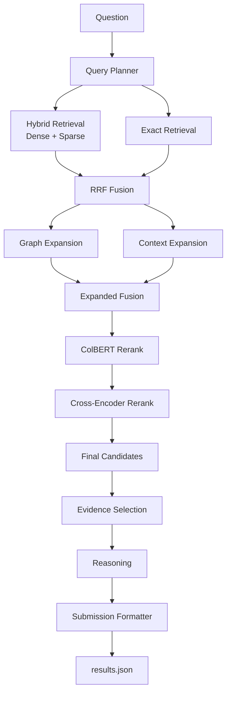

# Legal Agent RAG

Hệ thống hỏi đáp pháp luật Việt Nam theo hướng multi-stage RAG, tập trung vào:

- xử lý dữ liệu văn bản pháp luật,
- build retrieval corpus,
- ingest vào Qdrant,
- chạy retrieval / rerank / inference,
- xuất `results.json` đúng format nộp bài.

## Pipeline



## Retrieval-only mode

Repo hiện đã hỗ trợ `RETRIEVAL_ONLY=true`.

Khi bật mode này:

- không dùng Query Planner LLM,
- không dùng Evidence Selector,
- không dùng Reasoner,
- không sinh answer,
- query đi thẳng vào retrieval,
- lấy top-k cuối để map sang:
  - `relevant_docs`
  - `relevant_articles`
- `answer` luôn là `""`

Mode này dùng để test retrieval có ra đúng văn bản / điều khoản hay không.

## Cấu trúc repo

```text
scripts/        Script download, process, ingest, inference, submission
src/agents/     Agent nghiệp vụ
src/common/     Config, embedding, BM25
src/data/       Xử lý dữ liệu nguồn
src/generation/ LLM clients
src/indexing/   Qdrant collection, graph index
src/pipeline/   Inference pipeline
src/retrieval/  Retrieval, fusion, expansion, rerank
src/schema/     Pydantic schema
src/submission/ Validate và ghi kết quả
tests/          Unit tests
```

## Yêu cầu

- Python 3.11
- PowerShell
- Docker Desktop hoặc Docker Engine
- Qdrant local
- GPU nếu muốn chạy rerank/local model nhanh hơn

## Cài đặt

```powershell
conda create -n legal_rag python=3.11 -y
conda activate legal_rag
pip install -r requirements.txt
```

Khởi động Qdrant:

```powershell
docker compose up -d
Invoke-WebRequest http://localhost:6333/healthz
```

## Cấu hình `.env`

Repo đang ưu tiên chạy bằng OpenRouter và đang bật retrieval-only để test retrieval.

Ví dụ:

```env
LLM_BACKEND=openrouter
OPENROUTER_API_KEY=your-openrouter-key
OPENROUTER_MODEL=meta-llama/llama-3.1-8b-instruct
OPENROUTER_BASE_URL=https://openrouter.ai/api/v1
OPENROUTER_TIMEOUT=120
OPENROUTER_RETRY_ATTEMPTS=4
OPENROUTER_RETRY_DELAY=5

QDRANT_URL=http://localhost:6333
QDRANT_API_KEY=
QDRANT_COLLECTION=legal_agent_rag_harrier_idf
QDRANT_TIMEOUT=120
QDRANT_HNSW_EF=64

DENSE_MODEL=mainguyen9/vietlegal-harrier-0.6b
COLBERT_MODEL=BAAI/bge-m3
CROSS_ENCODER_MODEL=Qwen/Qwen3-Reranker-0.6B

RETRIEVAL_TOP_K=120
INITIAL_FUSION_TOP_K=80
COLBERT_TOP_K=60
CROSS_ENCODER_TOP_K=40
FINAL_TOP_K=30

GRAPH_SEED_TOP_K=5
GRAPH_TOP_K=10
CONTEXT_TOP_K=10
PRELOAD_GRAPH=true

ENABLE_COLBERT=true
ENABLE_CROSS_ENCODER=true
ENABLE_REASONING=true
RETRIEVAL_ONLY=true
```

Ghi chú:

- `RETRIEVAL_ONLY=true`: chỉ test retrieval, không gọi agent/LLM.
- nếu muốn quay lại pipeline đầy đủ, đổi `RETRIEVAL_ONLY=false`.

## Chuẩn bị dữ liệu

```powershell
python .\scripts\01_download_data.py
python .\scripts\02_process_data.py
python -m src.indexing.build_graph
```

## Ingest vào Qdrant

Nếu đã có embedding shards:

```powershell
python -m scripts.modal_shards_to_qdrant --recreate --build-hnsw
python .\scripts\05_create_payload_indexes.py
```

## Chạy inference

### 1. Test 1 câu hỏi

```powershell
python .\scripts\03_run_inference.py `
  --query "Các cơ sở ươm tạo và khu làm việc chung được hưởng những chính sách hỗ trợ nào về thuế và đất đai?" `
  --question-id 1 `
  --output results.json
```

Trong `RETRIEVAL_ONLY=true`, output sẽ có:

- `answer = ""`
- chỉ map `relevant_docs` và `relevant_articles` từ top-k retrieval cuối

### 2. Chạy từ file input

```powershell
python .\scripts\03_run_inference.py `
  --input R2AIStage1DATA.json `
  --output results.json `
  --batch-size 1
```

### 3. Chạy batch 2000 câu

```powershell
python .\scripts\06_run_2000_queries.py `
  --input R2AIStage1DATA.json `
  --output results.json `
  --errors inference_errors.json `
  --limit 2000 `
  --resume
```

Script này:

- giữ model / retriever trong một process,
- ghi kết quả sau mỗi query,
- log lỗi vào `inference_errors.json`.

## Chuyển về pipeline đầy đủ

Muốn bật lại agent + LLM:

1. sửa `.env`

```env
RETRIEVAL_ONLY=false
```

2. chạy lại:

```powershell
python .\scripts\03_run_inference.py --query "Câu hỏi pháp luật"
```

## Đóng gói submission

```powershell
python .\scripts\04_build_submission.py --input results.json --output results.zip
```

`results.zip` là zip phẳng chỉ chứa `results.json`.

## Test

```powershell
python -m pytest -q
```

Một số nhóm test:

```powershell
python -m pytest .\tests\test_retrieval.py -q
python -m pytest .\tests\test_inference_pipeline.py -q
python -m pytest .\tests\test_endpoint.py -q
```

## Không commit

```text
.env
data/raw/
data/processed/
data/embedding_shards*/
data/qdrant_storage/
results.json
results.zip
inference_errors.json
*.parquet
*.pt
*.bin
*.safetensors
*.log
```
