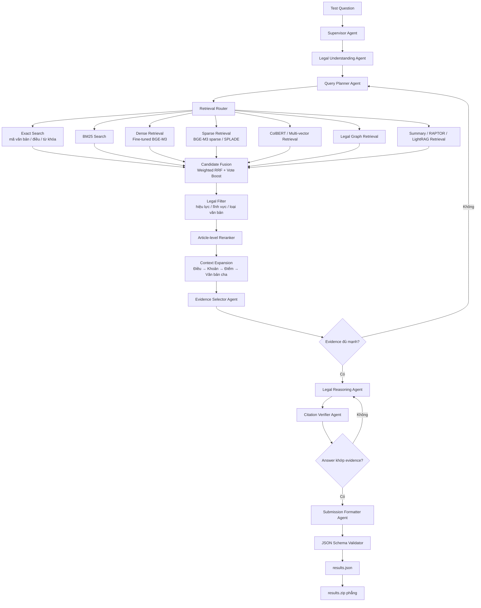

# Legal Agent RAG

Hệ thống hỏi đáp pháp luật tiếng Việt theo hướng multi-agent RAG. Mục tiêu là truy hồi đúng điều luật/văn bản liên quan, chọn evidence, kiểm chứng citation và xuất kết quả cuối theo định dạng submission.

## Pipeline



Luồng chính:

```text
Question
-> Legal Understanding
-> Query Planning
-> Multi-retrieval
-> Fusion + Filter + Rerank
-> Evidence Selection
-> Legal Reasoning
-> Citation Verification
-> results.json
-> results.zip
```

## Trạng thái hiện tại

Đã có:

- Download dữ liệu từ Hugging Face.
- Process dữ liệu Pháp điển.
- Process metadata và quan hệ văn bản VBPL.
- Schema cho `LegalDocument`, `LegalArticle`, `LegalEdge`.
- Tạo `legal_units.parquet`.
- Dense indexing lên Qdrant.

Đang cần triển khai tiếp:

- Các retriever: exact, BM25, sparse, ColBERT, graph.
- Fusion, reranker, context expansion.
- Các agent: supervisor, planner, evidence selector, reasoner, verifier, formatter.
- Validator và đóng gói submission.

## Cấu trúc repo

```text
configs/       Cấu hình data/model/retrieval/eval
scripts/       Script chạy pipeline
src/data/      Download, process, chuẩn hóa dữ liệu
src/schema/    Pydantic schema
src/indexing/  Build index
src/retrieval/ Retriever
src/agents/    Multi-agent workflow
src/eval/      Evaluation
src/submission Build, validate, zip kết quả
tests/         Unit tests
```

## Cài đặt

```bash
conda create -n legal_rag_agent python=3.11
conda activate legal_rag_agent
pip install -r requirements.txt
```

Nếu dùng Qdrant:

```bash
docker run -p 6333:6333 qdrant/qdrant
```

## Tải và xử lý dữ liệu

Chạy các lệnh từ thư mục gốc của repository.

### 1. Tải dữ liệu

```bash
python scripts/01_download_data.py
```

Script tải các nguồn Hugging Face vào `data/raw/`:

- Pháp điển: `tmquan/phapdien-moj-gov-vn`.
- Văn bản pháp luật: `th1nhng0/vietnamese-legal-documents`.
- VBPL Markdown: `tmquan/vbpl-vn`.
- Legal instruction: `duyet/vietnamese-legal-instruct`.

Dữ liệu có dung lượng lớn, cần bảo đảm đủ dung lượng ổ đĩa và kết nối
mạng ổn định.

### 2. Build dataset retrieval

```bash
python scripts/02_process_data.py
```

Script lần lượt:

1. Chuẩn hóa metadata văn bản VBPL.
2. Tách nội dung VBPL thành từng Điều.
3. Tạo quan hệ giữa các văn bản.
4. Chuẩn hóa dữ liệu Pháp điển.
5. Hợp nhất VBPL và Pháp điển thành `legal_units`.
6. Chia Điều dài thành retrieval chunks.
7. Tạo mapping dùng cho submission.

Các file đầu ra nằm trong `data/processed/`:

```text
documents.parquet
vbpl_articles.parquet
legal_edges.parquet
phapdien-moj-gov-vn.parquet
legal_units.parquet
retrieval_corpus.parquet
submission_mapping.parquet
```

Để chạy riêng từng bước:

```bash
python -m src.data.process_vbpl
python -m src.data.process_phapdien
python -m src.data.build_legal_units
python -m src.chunking.build_retrieval_corpus
python -m src.data.build_submission_mapping
```

## Test

```bash
pytest
```

Một số test yêu cầu đã có dữ liệu trong `data/processed/`.
